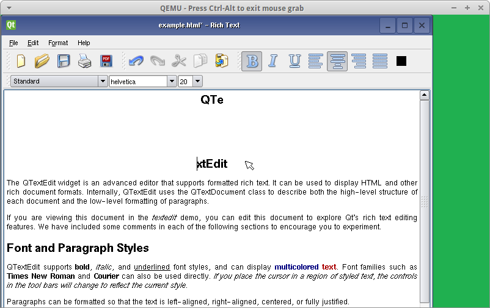

Embeded Viratualisation
=======================

In this lab, we get familiar with the Embedded XEN environment. First, we need to patch the current projet. Then we will try our first run of the virtualizer. We will then recompile the driver made in the last lab for the virualized kernel. Finaly we will make the driver for the non-priviliedged OS.

Workspace patching
------------------

First, we need to modify the ``repatar_sp6_buttons.c`` to compitle with the XEN (XEN is the virtualizer) extensions. This is done as following:

.. code-block:: c

    #include "reptar_sp6.h"
    
    #if 1
    #include <xen-guest/io/kbdif.h>
    #include <xen-guest/console.h>
    
    extern int omapfb_xen_switch_domain(domid_t dom);
    #endif
    
    static struct platform_device *reptar_sp6_btns;
    
We must then extract the Embedded XEN projet and compile it:

.. code-block:: console

    redsuser@vm-reds-2015s2:~/seee_student$ tar -xf embeddedxen.tar.bz2
    redsuser@vm-reds-2015s2:~/seee_student$ rm embeddedxen.tar.bz2
    redsuser@vm-reds-2015s2:~/seee_student$ ./buildex
    ...
      MV      xen/arch/arm/boot/Image.tmp to xen/arch/arm/boot/Image
      Kernel: xen/arch/arm/boot/Image is ready
      Kernel: xen/arch/arm/boot/uImage is being built...
      GZIP    arch/arm/boot/compressed/piggy.gz
      AS      arch/arm/boot/compressed/piggy.o
      LD      arch/arm/boot/compressed/vmlinux
      MV      xen/arch/arm/boot/Image to xen/arch/arm/boot/Image.final
      OBJCOPY arch/arm/boot/zImage
      Kernel: arch/arm/boot/zImage is ready
      UIMAGE  arch/arm/boot/uImage
    Image Name:   EmbeddedXen-4.0.2
    Created:      Mon May 30 21:29:42 2016
    Image Type:   ARM Linux Kernel Image (uncompressed)
    Data Size:    4902700 Bytes = 4787.79 kB = 4.68 MB
    Load Address: 80008000
    Entry Point:  80008000
      MV      uImage to uImage.reptar
      Kernel: arch/arm/boot/uImage.reptar is ready
    ######### WARNING Use uImage.reptar (instead of uImage)
    ------------------------------------------------------[ BUILDING EmbeddedXEN Hypervisor DONE ]---

We must copy the new root-fs filesystem to our workspace:

.. code-block:: console

    redsuser@vm-reds-2015s2:~/seee_student$ cp ~/Downloads/reptar4-sdcard.img filesystem/
    
    
Finally, we remplace the old linux kernel, with the XEN hypervisor:

.. code-block:: console

    redsuser@vm-reds-2015s2:~/seee_student$ mv uImage uImage.old
    redsuser@vm-reds-2015s2:~/seee_student$ ln -sf embeddedxen/uimage.embeddedxen.reptar uImage

The environement it now ready to be run!

EmbeddedXEN environement test
-----------------------------
We can now deploy our files (kernel module and test programs) to the new root-fs using the new version of the ``deploy`` script:

.. code-block:: console

    redsuser@vm-reds-2015s2:~/seee_student$ ./deploy ex
    Deploying into EmbeddedXEN rootfs ...
    Mounting filesystem/reptar4-sdcard.img...
    SD card partitions mounted in 'boot_tmp' and 'filesystem_tmp' directories
    Unmounting SD card image...
      Synchronizing .img file
      Unmounting 'boot_tmp' and 'filesystem_tmp'...
    Done !

We can launch the EmbeddedXEN hypervisor inside QEMU using the provided ``stex`` script. It will start QEMU with the new root-fs. The ``deploy`` script has copied the EmbeddedXEN hypervisor "kernel" image to the TFTP folder. So when we will boot from U-Boot, it will be run instead of the standrad linux kernel:

.. code-block:: console

    redsuser@vm-reds-2015s2:~/seee_student$ ./stex 
    ....
    
    
    U-Boot 2011.09-00000-g9af6a15 (Feb 10 2015 - 16:10:59)
    
    U-Boot code: 80008000 -> 80065570  BSS: -> 800F7C68
    .....
    Address in SROM is         52:54:00:12:34:56
    Address in environment is  e4:af:a1:40:01:fe
    
    Reptar # boot
    reading uImage
    
    4902764 bytes read
    ## Booting kernel from Legacy Image at 81600000 ...
       Image Name:   EmbeddedXen-4.0.2
       Image Type:   ARM Linux Kernel Image (uncompressed)
       Data Size:    4902700 Bytes = 4.7 MiB
       Load Address: 80008000
       Entry Point:  80008000
       Verifying Checksum ... OK
       Loading Kernel Image ... OK
    OK
    Using machid 0x2694 
    
    Starting kernel ...
    
    Using machid 0x2694 
    Uncompressing Xen........ done, booting the kernel.
      _____           _              _     _          ___  _______ _   _ 
     | ____|_ __ ___ | |__   ___  __| | __| | ___  __| \ \/ / ____| \ | |
     |  _| | '_ ` _ \| '_ \ / _ \/ _` |/ _` |/ _ \/ _` |\  /|  _| |  \| |
     | |___| | | | | | |_) |  __/ (_| | (_| |  __/ (_| |/  \| |___| |\  |
     |_____|_| |_| |_|_.__/ \___|\__,_|\__,_|\___|\__,_/_/\_\_____|_| \_|
                                                                         
      ____         
     |___ \  __  __
       __) | \ \/ /
      / __/ _ >  < 
     |_____(_)_/\_\
                   
    (XEN) EmbeddedXEN version 2.x / original XEN base: 4.0.2
    (XEN)  EmbeddedXEN - Reconfigurable Embedded Digital System 
    (XEN)                (REDS) Institute from HEIG-VD/Switzerland
    (XEN)  Copyright (c) 2007-2013 http://reds.heig-vd.ch
    (XEN) 
    (XEN)  Latest ChangeSet: 
    (XEN) 
    (XEN) EmbeddedXEN Hypervisor Memory Layout
    (XEN) ------------------------------------
    (XEN) Min page:                0x8005c (phys)
    (XEN) Max page (not included): 0x80c00 (phys)
    ......
    (XEN) OMAP clockevent source: GPTIMER1 at 32768 Hz
    [DOM-0] <4>Xen Start info :
    [DOM-0] <4>Magic : xen-4.0-arm_32
    [DOM-0] <4>Hypercall addr: ff00d820
    [DOM-0] <4>Total Pages allocated to this domain : 16384
    [DOM-0] <4>MACHINE address of shared info struct : 0x8024f000
    [DOM-0] <4>VIRTUAL address of page directory : 0xc0004000
    ...
    [DOM-U] ### HELLO FROM domU !!
    [DOM-U] Starting logging: OK
    [DOM-U] Starting mdev...
    [DOM-U] Initializing random number generator... done.
    [DOM-U] Starting network...
    [DOM-U] ip: can't find device 'eth0'
    [DOM-U] ip: SIOCGIFFLAGS: No such device
    [DOM-U] ip: can't find device 'eth0'
    [DOM-U] Starting dropbear sshd: OK
    [DOM-U] Starting sshd: OK
    [DOM-U] 
    [DOM-U] *** Welcome on REPTAR (HEIG-VD/REDS): use root/root to log in ***
    reptar login: root
    Password: 
    # 
    # uname -a
    Linux reptar 3.0.12-reptar #3 Mon May 30 21:28:37 CEST 2016 armv7l GNU/Linux

We can boserve that when U-Boot starts the uImage, it expand XEN instead of the linux kernel. We then get messages preceeded by the **(XEN)** header. Those are message from the EmbeddedXEN hypervisor. We then have message from the priviledged OS preceded by the **[DOM-0]** header. 

Using a tripple **CTRL+A** key combination, we can switch to the un-priviliged OS:

.. code-block:: console

    # *** Serial input -> DOMU (type 'CTRL-a' three times to switch input to Xen).
    [DOM-U] 
    [DOM-U] *** Welcome on REPTAR (HEIG-VD/REDS): use root/root to log in ***
    reptar login: root
    [DOM-U] Password: 
    [DOM-U] # uname -a
    [DOM-U] Linux reptar 3.4.6-paravirt #3 Mon May 30 21:29:22 CEST 2016 armv7-domUl GNU/Linux
    [DOM-U] # 
    
We can see now that the console is prefixed with the **[DOM-U]** header and that the runing kernel is patched. We see that from the *-paravirt* suffis in the version number.

We can try to run the Qt demo application from **Dom-0**:

.. code-block:: console

    # ./qtrun 
    Cannot open keyboard input device '/dev/input/event1': No such file or directory

The demo application shows up in the QEMU windows and is responsive. But whe we run it from the **DOM-U**, the QEMU windows does not updates:

.. code-block:: console

    # [DOM-0] <4>*** Serial input -> DOMU (type 'CTRL-a' three times to switch input to Xen).
    [DOM-U] 
    # ./qtrun 

SP6 driver deployment inside DOM-0
----------------------------------

In this section, we will re-compile, deploy and test the driver made in the last lab to the **DOM-0** (priviledged OS).

First we need to modify the ``Makefile`` to compiles agains the new kernel. For this, we modify the line 19 of it from this:

.. code-block:: make

    KDIR	= ../linux-3.0-reptar
    
To this

.. code-block:: make

    KDIR	= ../embeddedxen/linux-3.0-reptar-dom0
    
We can then recompile the kernel module (a clean is required, as we have changed the target OS):

.. code-block:: console

    redsuser@vm-reds-2015s2:~/seee_student$ cd drivers/
    redsuser@vm-reds-2015s2:~/seee_student/drivers$ make clean
    make -C ../embeddedxen/linux-3.0-reptar-dom0 M=/home/redsuser/seee_student/drivers ARCH=arm CROSS_COMPILE=arm-linux-gnueabihf- clean
    make[1]: Entering directory `/home/redsuser/seee_student/embeddedxen/linux-3.0-reptar-dom0'
      CLEAN   /home/redsuser/seee_student/drivers/.tmp_versions
      CLEAN   /home/redsuser/seee_student/drivers/Module.symvers
    make[1]: Leaving directory `/home/redsuser/seee_student/embeddedxen/linux-3.0-reptar-dom0'
    rm -f *.o
    rm -f *.ko
    rm -f buttons_test
    rm -f usertest
    rm -f Module.markers
    rm -f modules.order 
    redsuser@vm-reds-2015s2:~/seee_student/drivers$ make
    make -C ../embeddedxen/linux-3.0-reptar-dom0 M=/home/redsuser/seee_student/drivers ARCH=arm CROSS_COMPILE=arm-linux-gnueabihf- 
    make[1]: Entering directory `/home/redsuser/seee_student/embeddedxen/linux-3.0-reptar-dom0'
      LD      /home/redsuser/seee_student/drivers/built-in.o
      CC [M]  /home/redsuser/seee_student/drivers/reptar_sp6.o
    /home/redsuser/seee_student/drivers/reptar_sp6.c: In function 'fpga_read':
    /home/redsuser/seee_student/drivers/reptar_sp6.c:103:3: warning: format '%d' expects argument of type 'int', but argument 3 has type 'loff_t' [-Wformat]
      CC [M]  /home/redsuser/seee_student/drivers/reptar_sp6_leds.o
      CC [M]  /home/redsuser/seee_student/drivers/reptar_sp6_buttons.o
      LD [M]  /home/redsuser/seee_student/drivers/sp6.o
      Building modules, stage 2.
      MODPOST 1 modules
      CC      /home/redsuser/seee_student/drivers/sp6.mod.o
      LD [M]  /home/redsuser/seee_student/drivers/sp6.ko
    make[1]: Leaving directory `/home/redsuser/seee_student/embeddedxen/linux-3.0-reptar-dom0'
    arm-linux-gnueabihf-gcc -marm -I../embeddedxen/linux-3.0-reptar-dom0 -static buttons_test.c -o buttons_test
    arm-linux-gnueabihf-gcc     usertest.c   -o usertest
    redsuser@vm-reds-2015s2:~/seee_student/drivers$ 

We can now test the new comiled driver inside the **Dom-0** of the hypervisor. For this we need to deploy it first and the we can run the system and load the kernel module inside the priviledged os:

.. code-block:: console
    
    redsuser@vm-reds-2015s2:~/seee_student$ ./deploy ex
    Deploying into EmbeddedXEN rootfs ...
    Mounting filesystem/reptar4-sdcard.img...
    [sudo] password for redsuser: 
    SD card partitions mounted in 'boot_tmp' and 'filesystem_tmp' directories
    Unmounting SD card image...
      Synchronizing .img file
      Unmounting 'boot_tmp' and 'filesystem_tmp'...
    Done !
    redsuser@vm-reds-2015s2:~/seee_student$ ./stex
    ...
    Reptar # boot
    ...
    
    [DOM-U] *** Welcome on REPTAR (HEIG-VD/REDS): use root/root to log in ***
    reptar login: root
    Password: 
    # ./qtrun 
    Cannot open keyboard input device '/dev/input/event1': No such file or directory
    QObject: Cannot create children for a parent that is in a different thread.
    (Parent is QNativeSocketEngine(0x16f4140), parent's thread is QThread(0x1523290), current thread is EvtThread(0x1752dd0)
    
    # insmod /sp6.ko 
    reptar_sp6: module starting...
    [DOM-0] <4>Probing FPGA driver (device: fpga)
    [DOM-0] <7>Registered led device: sp6_led0
    [DOM-0] <7>Registered led device: sp6_led1
    [DOM-0] <7>Registered led device: sp6_led2
    [DOM-0] <7>Registered led device: sp6_led3
    [DOM-0] <7>Registered led device: sp6_led4
    [DOM-0] <7>Registered led device: sp6_led5
    [DOM-0] <4>IRQ_CTR_REG = 0x0080
    [DOM-0] <6>input: reptar_sp6_buttons as /devices/platform/fpga/reptar_sp6_buttons/input/input1
    [DOM-0] <4>reptar_sp6: done.
    # 
    # ./qtrun 

This demonstrate that before installing the driver, the application is un-responosive to the button actions. After installing the driver, pressing the middle button modify the text inside the application:

Dom-0 and Dom-U ineraction using para-virtualized input interface
-----------------------------------------------------------------

First, we have to register the button driver to the XEN infracstructure, to tell that is is a front-end driver. This is preaty straytforward, we just have to call the xenvkbd_inputdev_regsiter() function from the driver probe function:

.. code-block:: c

    static int reptar_sp6_buttons_probe(struct platform_device *pdev)
    {
    	// ...
    	struct input_dev *input;
    	
    
        // ...
    
    	/* Register the input device in XEN */
    	xenvkbd_inputdev_register(input, KEYBOARD);
    
    	return 0;
    }
    
After this, the button press are received by the **DomU**. We need alos a way to toggle the framebuffer from **Dom0** to **DomU** and vice-verca. For this, we can modifiy the threaded IRQ function to switch the framebuffer upon certain button press. The ``reptar_sp6_buttons_irq_thread()`` is modified as following:

.. code-block:: c

    static irqreturn_t reptar_sp6_buttons_irq_thread(int irq, void *dev_id)
    {
    	struct reptar_sp6_buttons *dev = (struct reptar_sp6_buttons *) dev_id;
    	struct input_dev *input = dev->input;
    	int pressed;
    	unsigned int key;
    
    	//printk("reptar_sp6_buttons_irq_thread()\n");
    
    	do {
    	  pressed = fls(dev->current_button);
    
    	  if (!pressed)
    	    return IRQ_HANDLED;
    
    	  key = dev->pdata->keys[pressed-1];
    
    
    	  if (key == KEY_BACKSPACE)
    	  {
    	      omapfb_xen_switch_domain(1);
    	      xenfb_set_focus(1);
    	  }
    	  else if (key== KEY_ESC)
    	  {
    	      omapfb_xen_switch_domain(0);
    	      xenfb_set_focus(0);
    	  }
    	  else
    	  {
    
    	      /* Report key press and release */
    	      input_report_key(input, key, 1);
    	      input_sync(input);
    
    	      input_report_key(input, key, 0);
    	      input_sync(input);
    	  }
    
    	  dev->current_button &= ~(1 << (pressed-1));
    
    	} while (dev->current_button);
    
    	return IRQ_HANDLED;
    }

So when the *ESC* key is pressed, we switch the framebuffer to **Dom0**. When the *BACKSPACE* key is pressed we switch it to **DomU**.

LED interface paravirtualization
--------------------------------

In this part, first we need to implement the LEDs driver for the **DomU**. This goes in two parts. The **DomU** kernel needs a "front-end" driver that emulate the periferal interface and pass the event to the "back-end" driver, in the **Dom0**, that will actualy interact with the hardware. As on the driver lab, we need to create the periferals of class "leddriver" from the module probe funcion:

.. code-block:: c

    struct xenvled_data {
    	char                *name;
    	int                 id;
    	struct led_classdev	cdev;
    };
    
    
    struct xenvled_data leds[6];

    static int ledfront_probe(struct xenbus_device *dev, const struct xenbus_device_id *id)
    {
    	int i;
    	int result;
    
    	//...
    	
    	for(i=0; i< 6; i++)
    	{
    	    leds[i].cdev.name = leds[i].name;
    	    leds[i].cdev.brightness_set = ledfont_led_set;
    
            result = led_classdev_register(&dev->dev, &leds[i].cdev);
            if(result)
            {
                printk( "can't allocate led driver %d\n", i);
                return -ENOENT;
    	   }
    	}
    
        //...
        
    	return result;
    }
    
This will create the ``/sys/class/leds/sp6_ledx`` folder like in the driver lab. When ``.../brightness`` file write call back is then implement as following:

.. code-block:: c

    struct xenvled_data {
    	char				*name;
    	int					id;
    	struct led_classdev	cdev;
    };
    
    
    struct xenvled_data leds[6] = {
        {.name="sp6_led0", .id=0},
        {.name="sp6_led1", .id=1},
        {.name="sp6_led2", .id=2},
        {.name="sp6_led3", .id=3},
        {.name="sp6_led4", .id=4},
        {.name="sp6_led5", .id=5},
    };

    static void ledfont_led_set(struct led_classdev *led_cdev, enum led_brightness value)
    {
    
      int id;
      int i;
    
      // Find the id
      for(i=0; i < 6; i++)
      {
        if(led_cdev == &leds[i].cdev)
        {
          id = leds[i].id;
        }
      }
      send_led_request(id, value);
    }
    
This passes the led set event with is ID and value to the **Dom0** driver via the XEN bus (internal IPC between the Doms). This will trigger an callback in the **Dom0** in the form of an virtual interrupt comming from the hardware. This will be the code of this "interrupt":

.. code-block:: c

    static void receive_led_request(int id, int brightness)
    {
    	/* How to interact with the LED subsystem and drive the LEDs? */
    	printk("%s(%d, %d)\n", __func__, id, brightness);
    
    	if(brightness)
    	{
    	    *led_reg |= (1 << id);
    	}
    	else
    	{
    	    *led_reg &= ~(1 <<id);
    	}
    }

This code simply write the hardware register, via the ``led_reg`` pointer. This pointer is global to the module (access limited to it using the ``static`` keyword) and intialized using ``ioremap()`` in the module probe() function:

.. code-block:: c

    static uint16_t* led_reg;

    static int ledback_probe(struct xenbus_device *dev, const struct xenbus_device_id *id)
    {
    	// ...
    
    	led_reg = ioremap(FPGA_BASE + LED_OFFSET, 4);
    	
    	// ...	
    }

    

